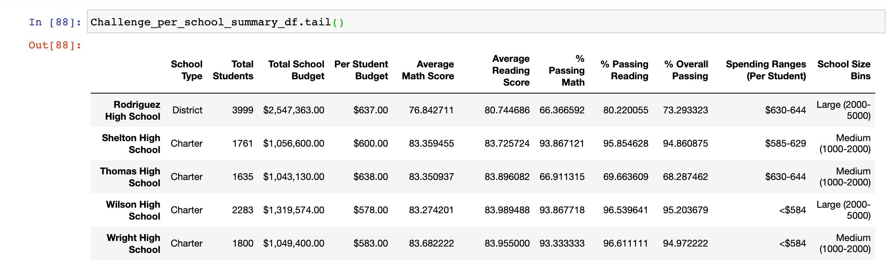
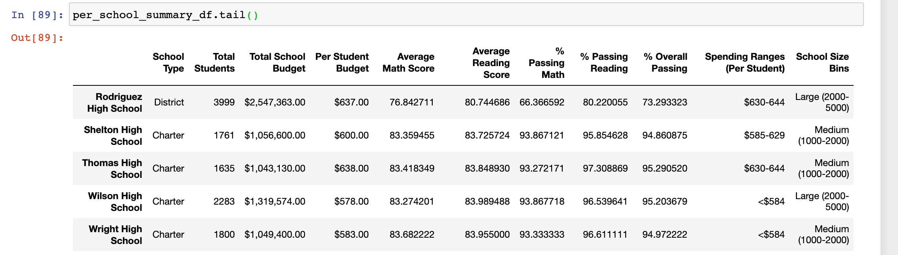

# School_District_Analysis
* Use Python and Pandas library to analyze school distrct data and showcase trends in school performance based on key metrics.
* Use Jupyter Notebook to visualize data outcomes as table format.
* This analysis assists the school board and district level in making desicions of budgets and priorities.
### The process of project
* Read raw data CSV file then clean and correct the incorrect data.
* Merge datasets to create new DataFrame gathering more information.
* Perform calculations  for key metrics use groupby() function.
* Visualize data with tables to tell story and showcase trends.
# Overview of the school district analysis: Explain the purpose of this analysis.
##  Comparing two analysis results after removing the ninth-grade math and reading scores from Thomas High School, make cohesive conclusions in Jupyter Notebook.
# Results

# Summaries
## After removing the ninth-grade math and reading scores from Thomas High School, it affact summary tables by slightly reducing the average scores and enomous decreasing for the passing percentage rate, including both passing percentage of math and reading score as well as overall passing percentage.
